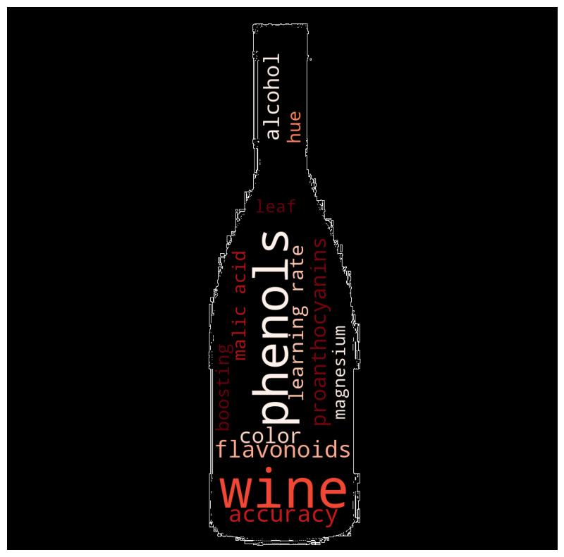

## Clasificación de vinos con Wandb

En este proyecto se utiliza Weights & Biases para ajustar y mejorar de manera sistemática  los hiperparámetros de un Clasificador de Impulso Gradual (Gradient Boosting) en el conjunto de datos público "wines".

### Dataset
El dataset 'wines'  es un dataset público que contiene 178 filas y 13 columnas. Algunos de los atributos de este dataset son el contenido en alcohol, las cenizas, polifenoles, flavonoides, ácido málico color y otros datos de interés del mundo del vino. 

### Experimento
Para este experimento se ha utilizado el Gradient Boosting Classifier, una herramienta de machine learning que construye árboles de decisiones de manera eficiente. Para encontrar el mejor modelo, se han probado diferentes combinaciones de una serie de parámetros. 

### Hyperparámetros 

Se han utilizado un totala de siete hiperparámetros diferentes. Los valores de cada hiperparámetro se presentan a continuación. Un total de 384 modelos fueron evaluados como resultado de las combinaciones de estos hiperparámetros.

Tasa de aprendizaje (learning rate): 0.01, 0.1, 0.2, 0.25  
Función de pérdida (loss function): deviance 
Profundidad máxima (max depth): 2, 3, 4, 5 
Mínimo de muestras por hoja (min_samples_leaf): 1, 2 
Mínimo de muestras para dividir (min_samples_split): 2, 4 
Número de estimadores (n_estimators): 50, 60 ,70 
Submuestreo (subsample): 0,8, 1.0 

En la siguiente enlace pueden observar los resultados de exactitud (accuracy) obtenidos con diferentes modelos que combinan diferentes hiperparámetro: 
https://wandb.ai/ioana-cretu22/wine-project/reports/Boosting-WineClassification-Wandb--Vmlldzo1ODk4MDE3 

### Mejor modelo 

El modelo con la puntuación más alta fue:

gbm_lr0.2_depth3_est70_lossdeviance_subsample1.0_minsplit4_minleaf2.

Este modelo específico tiene los siguientes hiperparámetros:

Tasa de aprendizaje: 0.2  
Función de pérdida: deviance 
Profundidad máxima: 3 
Mínimo de muestras por hoja: 2 
Mínimo de muestras para dividir: 4 
Número de estimadores: 70 
Submuestreo: 1.0 

La exactitud (accuracy) conseguida con este modelo fue de 0.9021 .
